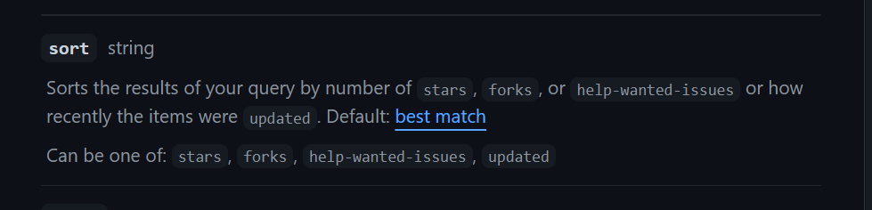

# React 17 template + styled-components + useQuery + MSW
 

## Overview:
Our app should allow to search Github for users and repositories.

- API URL: [Github REST API(v3)](https://docs.github.com/en/rest)
- Demo on Netlify: [LINK](https://rynio-github-issues-app.netlify.app/)
- Repo url: [LINK](https://github.com/PiotrRynio/github-issues-app)

## Running this project locally:

1. Clone this project locally.
2. Run `npm install` in your bash/command line.
3. Run `npm run start` in your bash/command line.
4. Go to `http://localhost:3000/` in your browser (or other from your bash/command line info).

Others:

1. Compile and minify for production `npm build`
2. Run all tests `npm test`

## Project rules:

- [css order](https://css-tricks.com/poll-results-how-do-you-order-your-css-properties/)
- [commit notation](https://gist.github.com/brianclements/841ea7bffdb01346392c#type)

## Problems with initial description of task and solutions:

1. Sorting repositories by ID is not possible in queries in Github REST API(v3). I could use only`stars`, `forks`
   , `help-wanted-issues`, `updated`. I set `default` order.
   [Read documentation.](https://docs.github.com/en/rest/search#search-repositories)
   
2. Similar situation like in 1st point. I set `default` order.
   [Read documentation.](https://docs.github.com/en/rest/search#search-users)
   
3. Api does not allow you to fetch both repositories and users in one query in Github REST API(v3). I decided to download
   them separately, then present them in one list. According to the description of the task, I sort
   them according to the id by the application level, due to the previous points.
4. According to the description of the task, pagination is not implemented. It is fetched only 5
   first items.
5. In the Figma project there were different dimensions of the same components. It was impossible to
   use Pixel Perfect. I made that this app looks good.

## Authenticating with GitHub Api:
Generate new token and set it in `.local.env` file in `GITHUB_REST_API_TOKEN` variable.
You can generate new token in [Github developer settings](https://github.com/settings/tokens).
During generating token don't addi permissions.
 
## Authors:

*Piotr Rynio*  
Contact:
pwrynio@gmail.com  
github.com/PiotrRynio/

   